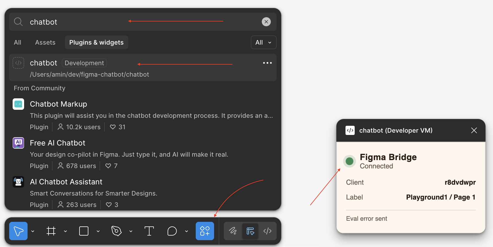

# figma-chatbot

A Claude Code plugin that lets Claude execute JavaScript directly in your Figma documents via a local WebSocket bridge.



```
┌─────────────────┐       ┌─────────────────┐       ┌─────────────────┐
│   Claude Code   │       │  figma-daemon   │       │  Figma Plugin   │
│                 │       │  (localhost)    │       │  (ui + sandbox) │
│  /figma cmd ────┼──ws──►│                 │◄──ws──┼─────────────────│
│                 │       │   :7017         │       │   figma.* API   │
└─────────────────┘       └─────────────────┘       └─────────────────┘
        │                         │                         │
        │   eval request ────────►│────── forward ─────────►│
        │                         │                         │  executes JS
        │◄─────── result ─────────│◄─────── response ───────│
```

## Prerequisites

- [Bun](https://bun.sh) runtime

## Install

Add the marketplace, then install:

```sh
/plugin marketplace add aminroosta/figma-chatbot
/plugin install fig@fig
```

Or load locally for development:

```sh
git clone https://github.com/aminroosta/figma-chatbot.git
claude --plugin-dir ./figma-chatbot
```

## Figma Client Setup

1. Open Figma Desktop app with a design file open
2. **Plugins → Development → Import plugin from manifest**
3. Select `~/.claude/plugins/fig/fig/chatbot/` (contains `manifest.json`)
4. Press `Cmd+/`, search "chatbot", press enter to launch; keep the plugin window open
5. In Claude Code CLI, use `/fig:go` to evaluate JS in Figma

The plugin UI shows connection state, client ID, and current document/page selected.

## Commands

| Command | Purpose |
|---------|---------|
| `/fig:setup` | Verify Bun, confirm plugin folder, print Figma import instructions |
| `/fig:go` | Start daemon if needed, evaluate JS in connected Figma client |

### `/fig:go`

With no arguments, reports daemon status and connected clients.

With JS (inline or fenced block):

```
/fig:go
figma.currentPage.selection
```

Returns JSON: `{ ok, result, logs }` or `{ ok: false, error, logs }`.

Multi-client: if multiple Figma windows are connected, pass `--client <id|index>` to target one.

## Architecture

See [docs/architecture.md](docs/architecture.md) for protocol details, data flow, and component responsibilities.

## Files

```
.claude-plugin/
  plugin.json                # Claude Code plugin manifest
  marketplace.json           # Marketplace catalog for distribution
skills/setup/                # /fig:setup
skills/go/                   # /fig:go
figma.ts                     # CLI client (status/start/stop/eval)
figma-daemon.ts              # WebSocket server on 127.0.0.1:7017
chatbot/                     # Figma dev plugin (manifest, ui.html, code.js)
docs/                        # Architecture, cheatsheets
```

## Troubleshooting

| Symptom | Fix |
|---------|-----|
| `bun: command not found` | Install Bun, restart shell |
| Daemon running but "no clients" | Open Figma, import + run the dev plugin |
| Port 7017 in use | `bun figma.ts stop` or kill stale process via `/tmp/figma-chatbot.pid` |
| Plugin UI says "disconnected" | Daemon not running; `/fig:go` auto-starts it |

## License

MIT
